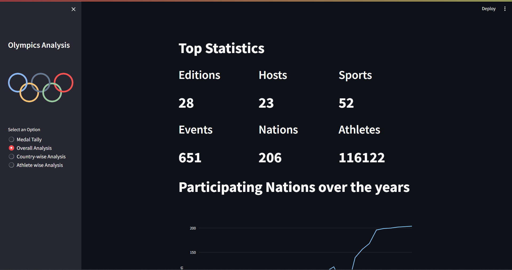

# Olympics-Data-Analysis-with-Deployment


This Streamlit web app performs data analysis on the Olympics dataset. It provides insights into medal tallies, overall statistics, country-wise analysis, and athlete-wise analysis. The app is designed to explore and visualize trends and patterns in the data.



## Dataset used
- [Olympics Dataset](https://www.kaggle.com/datasets/heesoo37/120-years-of-olympic-history-athletes-and-results)

## Project Structure

- **data** folder:
  - `athlete_events.csv`: Contains the main dataset with information about athletes and their performances.
  - `noc_regions.csv`: Contains information about NOC (National Olympic Committee) regions.

- **app.py**: Main application script written in Streamlit. It uses the Streamlit library for creating a web interface and pandas, plotly, matplotlib, seaborn for data analysis and visualization.

- **helper.py**: Helper functions for data processing and analysis. It includes functions for fetching medal tallies, creating line charts over time, generating heatmaps, and more.

- **preprocessor.py**: Contains a preprocessing function to clean and modify the dataset.

## How to Run

1. **Clone the Repository**:
   ```bash
   git clone https://github.com/hardikjp7/Olympics-Data-Analysis-with-Deployment.git
   cd Olympics-Data-Analysis-with-Deployment
   ```

2. **Install Dependencies**:
   ```bash
   pip install -r requirements.txt
   ```

3. Execute the Streamlit app:
   ```
   streamlit run app.py
   ```

4. Access the app through the provided URL in the terminal.

## Usage

1. **Medal Tally**: Select the year and country to view the corresponding medal tally.

2. **Overall Analysis**: Explore overall statistics, including the number of editions, host cities, sports, events, athletes, and participating nations over time.

3. **Country-wise Analysis**: Analyze medal tallies and top athletes for a specific country.

4. **Athlete-wise Analysis**: Explore the distribution of athlete ages, successful athletes, and height vs weight for different sports.

## Note

- The app uses the Olympics dataset (`athlete_events.csv`) and the NOC regions dataset (`noc_regions.csv`).
- Make sure to have the required Python libraries installed.


Feel free to explore and modify the code to suit your needs. Happy analyzing!
